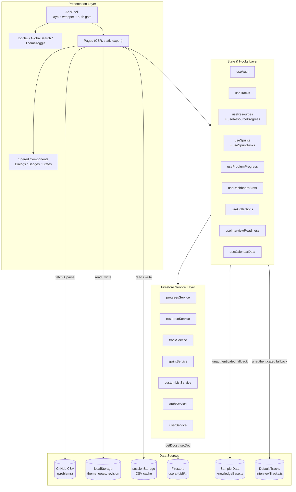

# Interview Tracly — Architecture Document

> *Review date: July 2026*
> *See [Implementation Plan](IMPLEMENTATION_PLAN.md) for the phased feature roadmap.*

---

## High-Level Architecture



**Key architectural principles:**
- **Static export** (`output: 'export'`): Zero server runtime. All data fetched client-side after JS hydration.
- **Optimistic updates**: Every mutation updates local state immediately, syncs to Firestore in background, rolls back on failure.
- **Feature-sliced**: Hooks encapsulate all data logic; pages are thin composition layers.
- **Parallel systems**: "Problems" (CSV-sourced LeetCode) and "Knowledge Resources" (Firestore-stored prep materials) coexist with separate data models but unified UI patterns.

---

## 1. Data Architecture

### Firestore Schema — All under `users/{uid}/`

| Collection | Document ID | Key Fields | Service |
|---|---|---|---|
| `users/{uid}/progress/{problemId}` | Problem slug | `solved`, `attempted`, `bookmarked`, `inRevisionList`, `notes`, timestamps | `progressService.ts` |
| `users/{uid}/activity/{date}` | ISO date | `solvedCount`, `attemptedCount` (atomic increments) | `progressService.ts` |
| `users/{uid}/resources/{resourceId}` | Auto `res_...` | `title`, `company`, `track`, `difficulty`, `tags`, `resourceLinks[]`, `askedAt`, `notes` | `resourceService.ts` |
| `users/{uid}/resourceProgress/{resourceId}` | Auto | `status`, `inRevisionList`, `personalNotes`, timestamps | `resourceService.ts` |
| `users/{uid}/tracks/{trackId}` | User/auto | `name`, `icon`, `color`, `description`, `shortDescription` | `trackService.ts` |
| `users/{uid}/sprints/{sprintId}` | Auto `sprint_...` | `name`, `goal`, `status`, `startDate`, `endDate`, `capacityHours`, `retro?`, timestamps | `sprintService.ts` |
| `users/{uid}/sprints/{sprintId}/tasks/{taskId}` | Auto `task_...` | `SprintTaskV2`: `type`, `itemId`, `title`, `description`, `track`, `category`, `priority`, `difficulty`, `estimatedHours`, `actualHours`, `status` (backlog/todo/in-progress/review/done), `dueDate`, `company`, `tags[]`, `collectionIds[]`, `notes`, `linkedProblemIds[]`, `linkedResourceIds[]`, `order`, timestamps | `sprintService.ts` |
| `users/{uid}/activity/{eventType}` | Auto | `type` (sprint_start/sprint_complete/task_done), `sprintId`, `taskId?`, `title`, `timestamp` | `activityService.ts` |
| `users/{uid}/customLists/{listId}` | Firestore auto | `name`, `description`, `problemIds[]` | `customListService.ts` |
| `users/{uid}` (profile) | UID | `displayName`, `email`, `photoURL`, `lastLoginAt` | `userService.ts` |

### Data Flow Pattern (every data hook)

```
User Action
    ↓
Hook mutation (e.g. addResource)
    ├─ 1. Build new entity with generated ID
    ├─ 2. Optimistic update: refMirror.current + setState
    ├─ 3. Fire-and-forget: service.addResource()
    └─ 4. On error → rollback: restore refMirror to pre-mutation state

Special cases:
  - useCustomLists: ref mirror + rollback (same as above, migrated from reload())
  - useSprintTasks: refMirror is a Map<sprintId, SprintTaskV2[]> with deep clone on snapshot
```


### Problem Data (NOT in Firestore)

- **Source**: `https://raw.githubusercontent.com/prakash144/leetcode-company-wise-problems/main/{company}/{list}.csv`
- **Parsing**: `papaparse` in `fetchQuestions.ts` / `fetchUnifiedProblems.ts`
- **Caching**: `sessionStorage` (per-company lists + unified aggregate)
- **Pipeline**: CSV → parsed rows → `Problem[]` → `useProblemWorkspaceData` → `QuestionTable`

---

## 2. Component Architecture

### Routing (static export — all routes known at build time)

| Route | Page | Purpose |
|---|---|---|---|
| `/` | Dashboard | Profile, stats, widgets, active sprint, quick task status toggle |
| `/problems` | Problems | Filterable Kanban-style problem workspace |
| `/sprints` | Sprints | Sprint list + 5-column Kanban detail + retro + analytics |
| `/tracks` | Tracks | Track grid + inline detail view (Manage dialog) + bookmarked resources |
| `/tracks/[trackId]` | TrackDetail (SSG) | Pre-rendered detail for 7 default tracks |
| `/progress` | Progress | Charts, knowledge base stats, heatmap |
| `/activity` | Activity | Calendar, sprint timeline events, revision tracker |
| `/readiness` | Readiness | Company readiness score + action plan |
| `/collections` | Collections | Sidebar + filtered problem grid |
| `/settings` | Settings | Theme, accent, account |
| `/favorites` | Favorites | Bookmarked knowledge resources (rewritten) |
| `/my-lists`, `/analytics` | Redirect | → `/collections` or `/progress` |

### Component Nesting

```
AppShell
├── TopNav
│   ├── Logo
│   ├── Desktop NavLinks (8 items)
│   ├── SearchTrigger → GlobalSearch (Cmd+K Dialog, problems + resources)
│   ├── ThemeToggle
│   ├── UserMenu
│   └── Mobile: Sheet drawer (same 8 items)
├── <main>  ← animate-in fade-in
│   ├── PageHeader
│   └── [Page Content]
└── Footer

Shared Sprint Components:
  SprintDashboardHeader — stat cards (progress, capacity, estimated, remaining) + progress bar + track breakdown
  SprintAnalytics — completed vs remaining, estimated vs actual, track breakdown bars
  SprintBoard — 5-column Kanban (Backlog/ToDo/InProgress/Review/Done) with @dnd-kit
  SortableTaskCard — rich card: priority, track badge, difficulty, est hours, tags, company, edit/delete
  TaskDetailDialog — full editor: all SprintTaskV2 fields, linked problems/resources, tags, notes
  FilterBar — search + dropdowns for track/priority/status/company/difficulty + clear button

Shared Resource Components:
  FavoriteResourcesWidget — bookmarked resources displayed on dashboard
  ResourceQuickLink — compact resource chip for inline linking
```

### Auth Flow

```
RootLayout (layout.tsx)
  → AuthProvider (context)
    → onAuthStateChanged → user | null
      → AppShell checks isConfigured
        → if not: AuthUnavailable (full-screen)
        → if yes: render children
          → Pages check auth.user individually
            → some show content for guests (Dashboard, Problems, Tracks, Progress, Activity, Readiness)
            → some gate behind sign-in (Sprints, Collections)
```

---

## 3. Gap Analysis

### 🔴 Critical Issues

| # | Gap | Location | Impact |
|---|---|---|---|
| G1 | **No Firestore index configuration** — `orderBy("createdAt", "desc")` in sprintService, activityService, trackService without `firestore.indexes.json` | All service files | Queries fail at runtime when >10 docs match; Firestore requires composite indexes |
| G2 | ~~Delete sprint doesn't cascade to tasks~~ | `sprintService.ts` | ✅ Already implemented — `deleteSprint()` batch-deletes tasks subcollection |
| G3 | **No real-time Firestore listeners** — all reads use `getDocs()` (one-shot) | Every service file | Data staleness within session; user must refresh to see changes |
| G4 | **Offline persistence not enabled** — no `enableMultiTabIndexedDbPersistence()` | Firebase init | App breaks on network loss |

### 🟡 Moderate Issues

| # | Gap | Location | Impact |
|---|---|---|---|
| G5 | **No migration path for old sprint tasks** — old `SprintTask` docs lack V2 fields; `migrateTask()` provides defaults but doesn't write back | `sprintService.ts` | Old tasks missing V2 fields remain in Firestore forever |
| G6 | **`orderBy("addedAt")` in task queries** — tasks ordered by `addedAt` instead of `order` field | `sprintService.ts` | `reorderTasks()` writes `order` but reads still sort by `addedAt` |
| G7 | **CollectionView prop drilling** — ~30 props passed through | `collections/page.tsx:131-148` | Hard to maintain; no composition pattern |
| G8 | **Sample resources not database-backed** — merged client-side, not in Firestore | `useResources.ts` | Deleting samples does nothing; ID conflicts possible |
| G9 | **No toast/snackbar system** — actions have no visual feedback | All hooks | Users don't know if save succeeded or failed |

### 🟢 Minor / Cosmetic

| # | Gap | Location | Impact |
|---|---|---|---|
| G10 | **No PWA service worker** — `manifest.json` exists but no offline support | Project root | App doesn't work offline despite being static-exportable |
| G11 | **No anonymous auth** — only Google Sign-In | `authService.ts` | Users without Google accounts cannot create persistent data |
| G12 | **GlobalSearch fetches all problems on mount** — 5 remote CSVs on every dialog open | `GlobalSearch.tsx` | Unnecessary network requests after initial cache |
| G13 | **No loading/error states for bookmarks** — `FavoriteResourcesWidget` returns `null` if empty | `FavoriteResourcesWidget.tsx` | No visual feedback while loading |

### ✅ Resolved Gaps

| # | Gap | Resolution |
|---|---|---|
| ~~G2~~ | Track deletion orphans resources | Cascade delete with confirmation dialog added (Phase I.3) |
| ~~G3~~ | SprintTask missing `order` field | Added `order?: number` to SprintTask interface (Phase I.1) |
| ~~G4~~ | useCustomLists skips optimistic updates | Rewritten with ref mirror + rollback pattern (Phase I.2) |
| ~~G10~~ | Problems not in Global Search | Problems now appear grouped under "Problems" section (Phase I.4) |

---

## 4. Feature Roadmap

### ✅ Recently Completed (Phase I + Phase II)

| # | Feature | When |
|---|---|---|
| F1 | **SprintTask order field** (I.1) | ✅ Done |
| F2 | **Optimistic updates for customLists** (I.2) | ✅ Done |
| F3 | **Cascade track delete** with confirmation (I.3) | ✅ Done |
| F4 | **Problems in Global Search** (I.4) | ✅ Done |
| F5 | **SprintTaskV2 data model** — 20+ fields, capacityHours, priority, track, tags, links (II.1) | ✅ Done |
| F6 | **SprintDashboardHeader** — stat cards, progress bar, track breakdown (II.2) | ✅ Done |
| F7 | **5-column Kanban** — Backlog/ToDo/InProgress/Review/Done (II.3) | ✅ Done |
| F8 | **Rich task cards** — priority badge, track chip, difficulty, est hours, tags, company, inline edit (II.4) | ✅ Done |
| F9 | **Filter + search in Sprint Board** — 6 filter dimensions + clear (II.5) | ✅ Done |
| F10 | **TaskDetailDialog** — full task editor with linked problems/resources, tags, notes (II.6) | ✅ Done |
| F11 | **SprintAnalytics** — completed vs remaining, estimated vs actual, track breakdown (II.7) | ✅ Done |
| F12 | **Dashboard quick status toggle** — one-click mark done from dashboard (II.8) | ✅ Done |
| F13 | **Activity timeline integration** — sprint events logged via activityService (II.9) | ✅ Done |
| F14 | **Backlog column** — uncommitted tasks in sprint board (II.10) | ✅ Done |
| F15 | **FavoriteResourcesWidget** — bookmarked resources on dashboard | ✅ Done |
| F16 | **Resources page** — rewritten with bookmarks | ✅ Done |

### 🚀 Next Up (critical gaps to fix now)

| # | Feature | Rationale | Effort |
|---|---|---|---|
| F17 | **Firestore indexes config** | Add `firestore.indexes.json` for all compound `orderBy` queries. Without this, app breaks at >10 docs. | 15 min |
| F18 | **Cascade delete sprint tasks** | Delete `tasks` subcollection when sprint doc is deleted. | Small |
| F19 | **Offline persistence** | Call `enableMultiTabIndexedDbPersistence()` in Firebase init. | Tiny (1 line) |
| F20 | **Toast notification system** | Add Sonner/react-hot-toast for visual feedback on all CRUD actions. | 30 min |
| F21 | **Fix task query ordering** | Switch `orderBy("addedAt")` → `orderBy("order")` in sprint task queries. | Small |

### 💡 Innovative features (differentiator, high impact)

| # | Feature | Description |
|---|---|---|
| F22 | **AI-Powered Sprint Suggestions** | After retro, AI analyzes weaknesses and auto-creates next sprint with relevant tasks |
| F23 | **Smart Daily Mission** | Widget that picks 1-2 tasks from active sprint + 1 revision item via spaced repetition |
| F24 | **Track Merge / Archive** | Merge two tracks (combine resources), archive a track (hide but keep data) |
| F25 | **Problem ↔ Resource Linking** | Link problems to knowledge resources and display chips on both sides |

### 📅 Later (value-add but not critical)

| # | Feature | Description |
|---|---|---|
| F26 | **Real-time Firestore listeners** | Convert `getDocs` → `onSnapshot` for live cross-device updates |
| F27 | **PWA / Offline Support** | Service worker + cache-first strategy for static assets |
| F28 | **Data Export / Import** | Export all user data as JSON; import to restore |
| F29 | **Collaborative Sprints** | Share a sprint with another user via invite link; task assignment |
| F30 | **Email/PW Auth + Anonymous** | Expand beyond Google Sign-In |
| F31 | **Kanban Swimlanes** | Group sprint tasks by type or company within the board |
| F32 | **Readiness Score History** | Track readiness score changes over time |

---

## 5. Implementation Plan

### Phase I — Core Gap Fixes ✅ DONE

| Item | Effort | Status |
|---|---|---|
| Add `order` field to SprintTask interface | 5 min | ✅ |
| Rewrite useCustomLists with optimistic update pattern | 30 min | ✅ |
| Cascade track delete with confirmation | 20 min | ✅ |
| Add problems to GlobalSearch | 45 min | ✅ |

### Phase II — Sprint Planning Overhaul ✅ DONE

| Component | New Files | Status |
|---|---|---|
| SprintTaskV2 / SprintV2 data model | `src/lib/sprints.ts` | ✅ |
| SprintDashboardHeader + SprintAnalytics | 2 new components | ✅ |
| 5-column Kanban board | `SprintBoard.tsx` rework | ✅ |
| Rich task cards + inline edit | `SortableTaskCard.tsx` | ✅ |
| Filter + search bar | Integrated in SprintBoard | ✅ |
| TaskDetailDialog | New component | ✅ |
| Dashboard quick status toggle | `page.tsx` widget | ✅ |
| Activity timeline integration | `activityService.ts` | ✅ |

### Phase III — Critical Infrastructure Fixes (Now, ~3h)

```
F17 [15min] Add firestore.indexes.json for all compound orderBy queries
F18 [30min] Add cascade delete for sprint tasks subcollection
F19 [1min]  Enable offline persistence in Firebase init
F20 [30min] Add toast notification system (Sonner)
F21 [15min] Fix task query orderBy("addedAt") → orderBy("order")
```

### Phase IV — High-Value Features (Next, ~6h)

```
F23 [2h]  Smart Daily Mission widget
F26 [2h]  Real-time Firestore listeners (onSnapshot)
F24 [2h]  Track Merge / Archive
F25 [2h]  Problem ↔ Resource Linking
```

### Phase V+ — Future (see full roadmap above)

---

## 6. Cross-Cutting Concerns

| Concern | Current Approach | Recommendation |
|---|---|---|
| **Error handling** | Per-hook `setError` string; global `error.tsx` | Add per-page ErrorBoundary components |
| **Loading states** | Each hook has its own `loading` bool; pages compose them with `||` | Consider `useCombinedLoading` utility for simplicity |
| **Type safety** | Strong interfaces across SprintTaskV2, SprintV2, ActivityEvent | Consider `zod` runtime validation for Firestore reads |
| **Performance** | All in-memory filtering; no virtualization | If resources >500, consider `react-window` for grid lists |
| **Accessibility** | Skip-to-content link, aria-labels on interactive elements | Audit with axe-core; add focus trapping in dialogs |
| **Testing** | None | Start with `vitest` on pure functions (readiness scoring, stats computation) |

---

> *This document should be updated as the architecture evolves. Key files to watch: `src/hooks/` (data layer), `src/services/firebase/` (persistence), `src/app/` (routes).*
